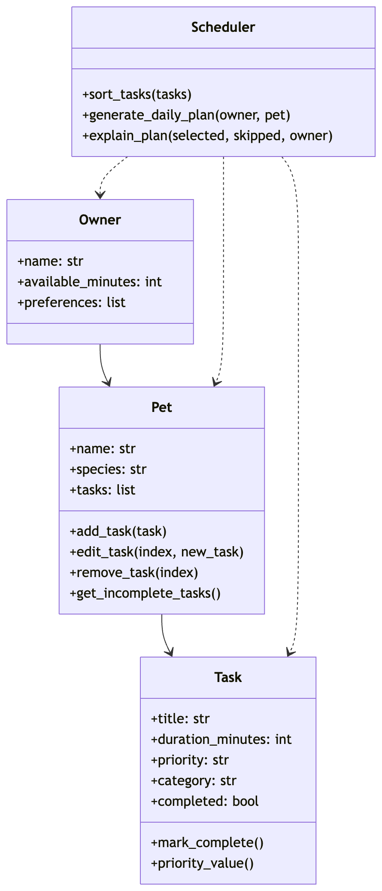

# PawPal+ 🐾

PawPal+ is a Streamlit app that helps a pet owner plan daily care tasks for their pet based on available time and task priority.

## Features

- Add owner and pet information
- Add pet care tasks with duration and priority
- Delete tasks from the current list
- Generate a daily schedule based on available times
- Show selected and skipped tasks
- Explain why each task was chosen or skipped
- Includes automated tests for core scheduling behavior

## Project Structure

- `app.py` - Streamlit user interface
- `pawpal_system.py` - backend classes and scheduling logic
- `tests/test_pawpal.py` - automated tests
- `reflection.md` - project reflection

## Scheduling Logic

The scheduler uses a simple greedy strategy:

1. It ignores completed tasks
2. It sorts tasks by priority
3. If priorities are equal, shorter tasks come first
4. It selects tasks until the owner's available time is used up

## System Architecture



## Run the App

```bash
python3 -m streamlit run app.py